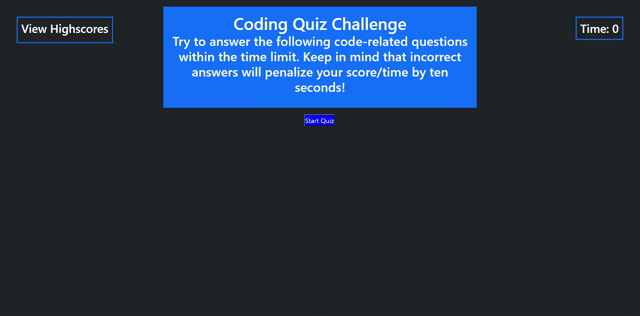

Basic Code Quiz

## Description

This application will run a simple coding quiz. The starting page Challenges the user to answer the code-related questions within the time limit, and informs the user that incorrect answers will penalize their score by ten seconds. The time is shown in the upper right hand corner. Clicking on the "View Highscores" area on the top left corner of the page will take the user to the highscore leaderboard. Clicking the "Start Quiz button will start the quiz.

Once the quiz begins, the timer will start. It is currently set at 30 seconds, and the quiz is set with only 3 questions. The time is adjustable in the code. New questions, choices, and answers can be added to the qBlock array.

When the quiz finishes (whether all of the questions have been attempted or the timer has run down) then the user will be given their highscore and allowed to enter their initials. Once initials have been submitted, the user will be presented with the highscore leaderboard. Below that will be the "Go Back" button and "Clear High Scores" button. The "Go Back" button will bring the user back to the starting page to begin the quiz again. The "Clear High Scores" button will clear the highscore data from the local storage and remove the highscores from the table.

As it is, the application runs as intended, but the code itself has areas that can be cleaned up and organized. 

## Application

The following animation demonstrates the application functionality:

https://bslindsa.github.io/basic-coding-quiz/

© 2021 Trilogy Education Services, LLC, a 2U, Inc. brand. Confidential and Proprietary. All Rights Reserved.
